# Endbericht

## Client-Side Filters

Client-side filters were realized as optical/rendering filters. Points are discarded during rendering inside the vertex shaders, but the original data structure remains untouched. The reasoning for this is that filtering my modifying the underlying data is a relatively slow process and with the limitations of WebGL, this would negatively impact the interactivity of creating and adjusting the filter regions. 

The trade-off between both approaches is, that rendering filters reduce the render performance slightly at all times, since additional hit-tests are done inside the vertey shader every frame, even for invisible points, whereas filters on the data structure would impact performance massively during creation and modification of the filter regions but improve performance afterwards since fewer points have to be processed by the vertex shader. 

However, even rendering-filters improve performance and/or quality because only octree nodes that intersect the filter regions are rendered. This allows to render visible regions at a higher level of detail, even with lower point budgets. 

The figure below shows a single box-filter used to either highlight a region of interest, only render points within that region, or discard points within that region.
The bottom row shows that with the inside-filter, the majority of octree nodes was discarded since they won't be visible, which allows us to improve the quality of the region that is visible.

<table>
	<tr>
		<td>
			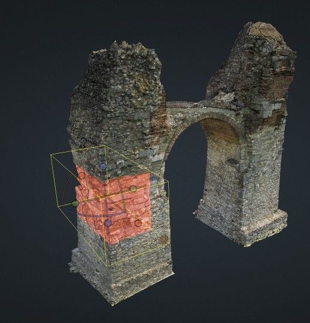
		</td>
		<td>
			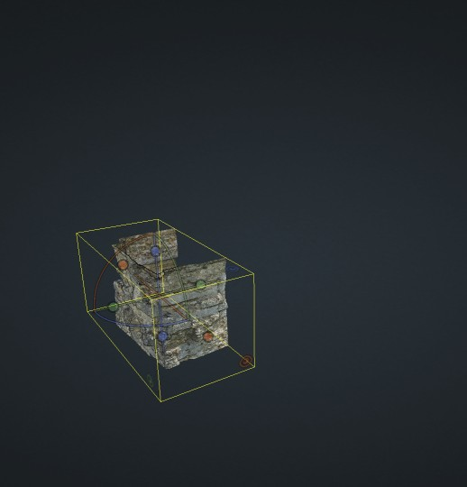
		</td>
		<td>
			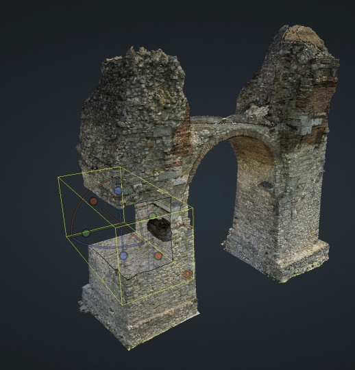
		</td>
	</tr>
	<tr>
		<td>
			
		</td>
		<td>
			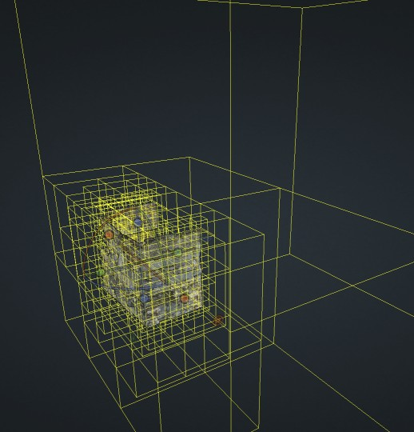
		</td>
		<td>
			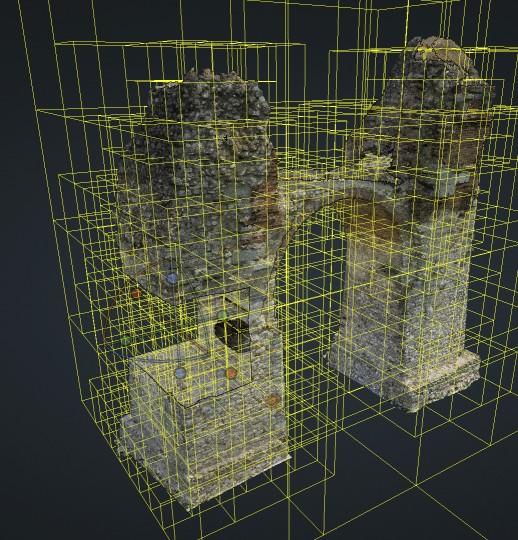
		</td>
	</tr>
	<tr>
		<td>
			Highlight
		</td>
		<td>
			Inside
		</td>
		<td>
			Outside
		</td>
	</tr>
</table>

 

For box-filters, we've explored basic relational algebraic functions that can be reasonably applied as rendering-filters. We ended up with following cases:

<table>
	<tr>
		<td>
			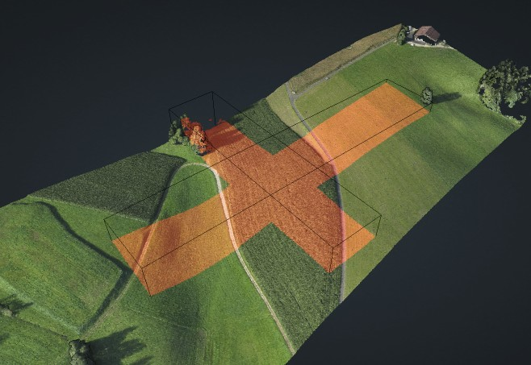
		</td>
		<td>
			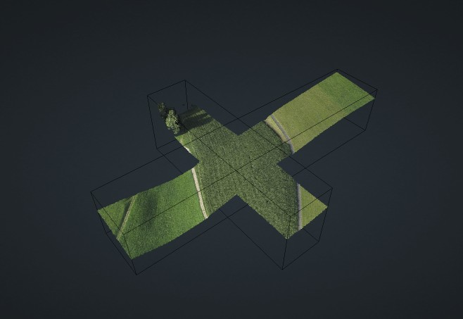
		</td>
		<td>
			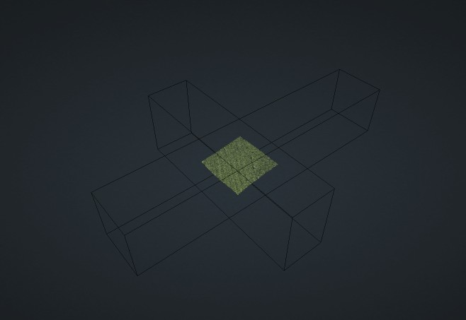
		</td>
		<td>
			
		</td>
		<td>
			
		</td>
	</tr>
	<tr>
		<td>Show points that are:</td>
		<td>inside any</td>
		<td>inside all</td>
		<td>outside any</td>
		<td>outside all</td>
	</tr>
</table>

 

Filtering using clip Polygons. As all client-side filters, they're implemented by discarding relevant points inside the shader. The data structure remains untouched. 
A limitation of this approach is that the clip-polygon has to remain relatively small, since hit-tests are done each frame during rendering. 

<table>
	<tr>
		<td>
			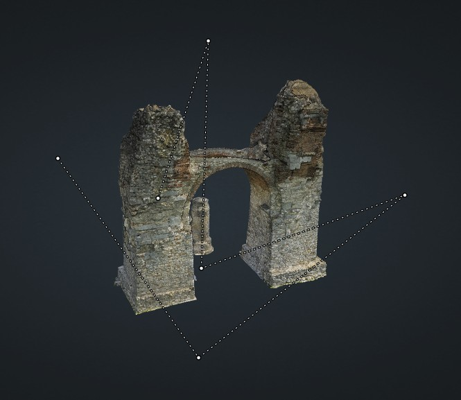
		</td>
		<td>
			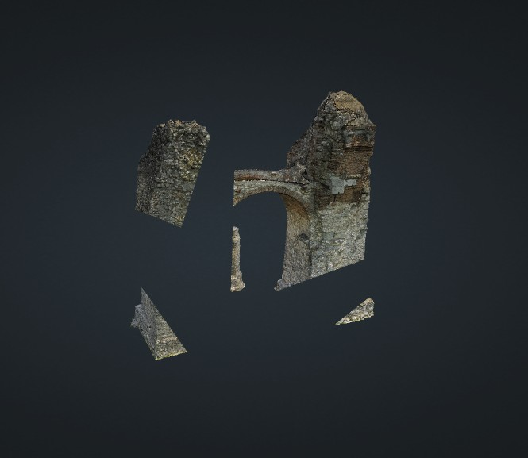
		</td>
	</tr>
	<tr>
		<td>Creating the clip-polygon</td>
		<td>Results after clip-polygon is applied</td>
	</tr>
</table>

## Server-Side Filters

The downside of client-side filters is that it's not feasible to extract and store the containing points on disk on client-side. The main reason is that the client is an application that only streams small parts of the octree data at any time, just enough to render large point clouds with the desired level of detail. 
However, clip-regions may consist of tens of millions to hundreds of millions of points. Web browsers are not suitable to load, process, and store data of this size. 

We've explored and developed a prototype server application that is capable of filtering and storing points within clip regions by request of clients. 
The client can ask the server to create a file that contains all points that are within one of its box-filters. 

We've explored two options to achieve sufficiently high performance: Filtering in C++ or filtering in Node.js. 
We've found that, while Javascript is generally significantly slower, it makes it much easier to write fast code with parallel I/O. 
In the end, we decided to use Javascript/Node.js because applying box-region filters tends to be more of an I/O bound task which Node.js excells at. Using Node.js's async I/O function, we ended up with a filter application that reads input, processes, and writes results all at the same time in parallel.

Peak performance we've achieved by only handling point clouds with position and color data:
* Input: Heidentor point cloud with 25M points total  
1 Filter box that contained 1412 octree nodes, with a total of 13M points, (~208MB)
* Output: 12.5M points => 311MB las file.
* Duration: ~1.6 seconds total, ~1.28 seconds for hit-tests
* Throughput: ~8M points per second; ~128MB in; ~192MB out
* Hardware: Intel i7 7500U, Kingston SATA SSD

Average performance after finishing the prototype, with support for varying attributes (position, color, intensity, classification, ...): ~3.5M points/s

## Orthographic Projection

Difference of rendering a cross-section with perspective and orthographic projetions.
In perspective projections, distant objects are smaller. As a result, we have unwanted distortion of what should be a straight line on a plan or map. 
We could decrease the width of the cross-section, but in many cases, low point densities have to be countered with larger cross-section width, otherwise we'd get empty or even sparse results.

<table>
	<tr>
		<td>
			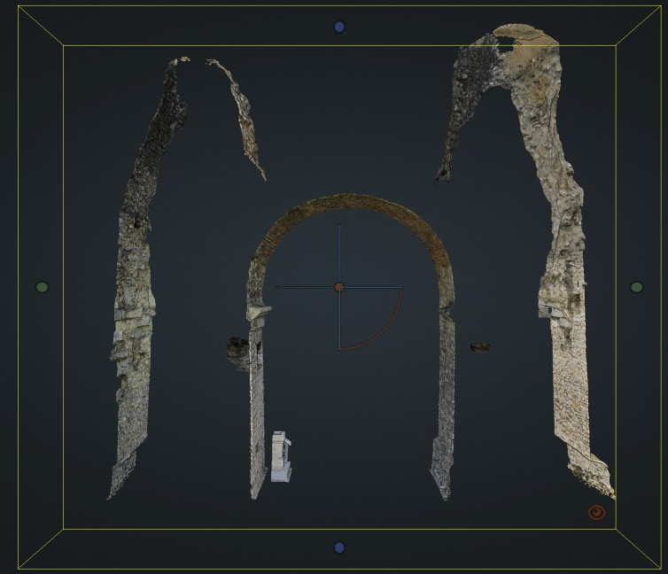
		</td>
		<td>
			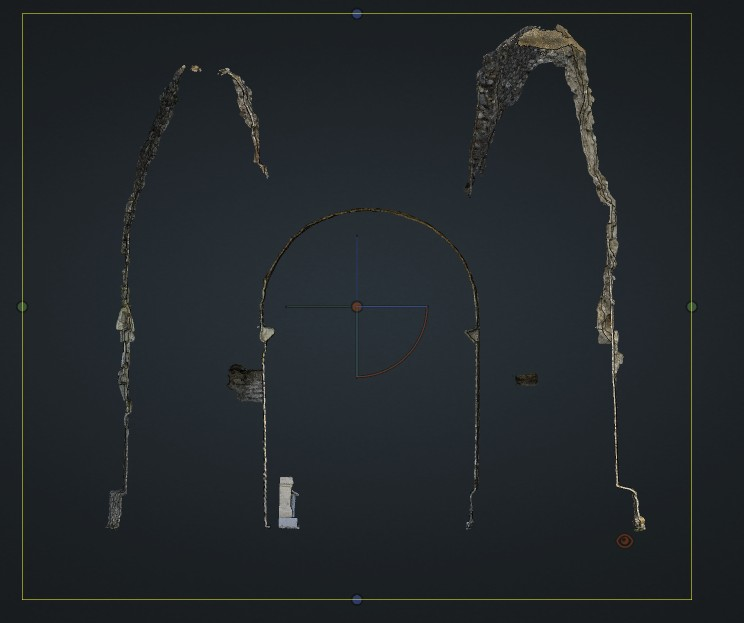
		</td>
	</tr>
	<tr>
		<td>Perspective </td>
		<td>Orthographic</td>
	</tr>
</table>

We adjusted the octree-traversal algorithm to incorporate properties of orthographic projections, since they are not affected by distance.
The images below show roughly the same view in a perspective setting to the left, and orthographic setting to the right, and how the visible hierarchy differs.
The bottom row shows points colored in the level of detail. 
The perspective projection has a high LOD close to the camera, whereas orthographic projections have a relatively uniform LOD over the whole visible range. 

<table>
	<tr>
		<td>
			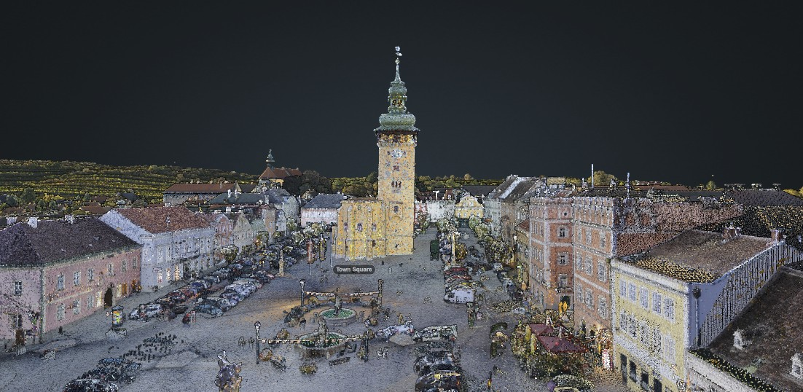
		</td>
		<td>
			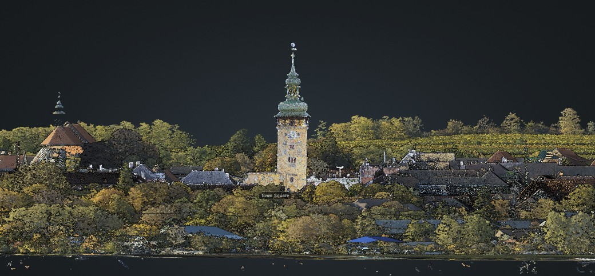
		</td>
	</tr>
	<tr>
		<td>
			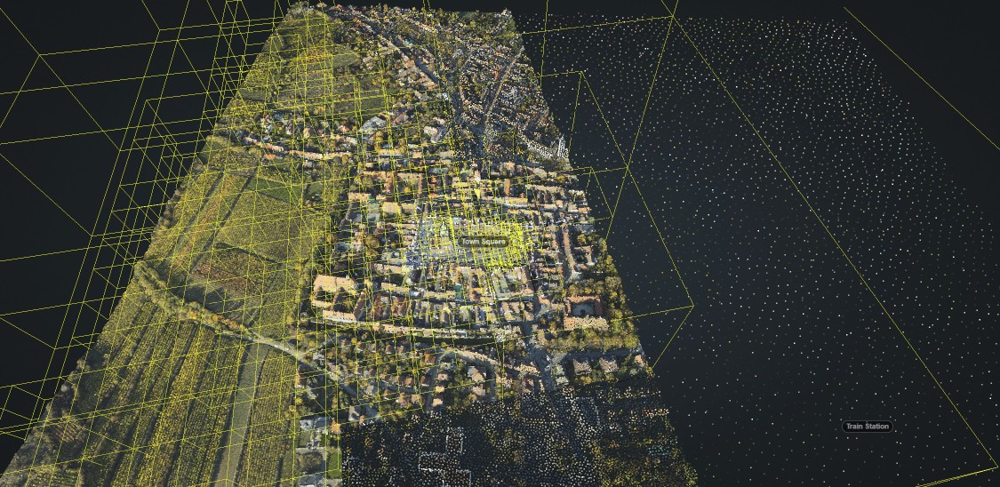
		</td>
		<td>
			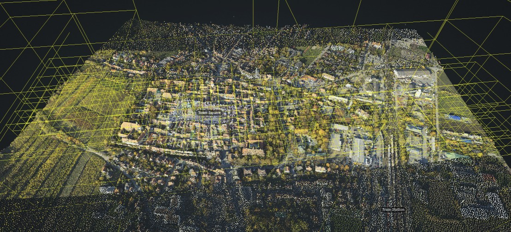
		</td>
	</tr>
	<tr>
		<td>
			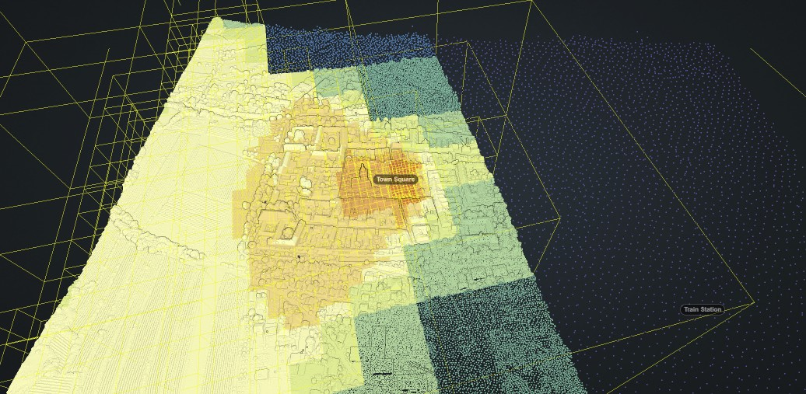
		</td>
		<td>
			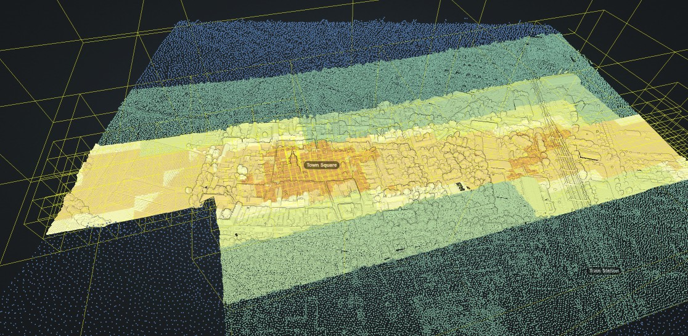
		</td>
	</tr>
	<tr>
		<td>Perspective </td>
		<td>Orthographic</td>
	</tr>
</table>